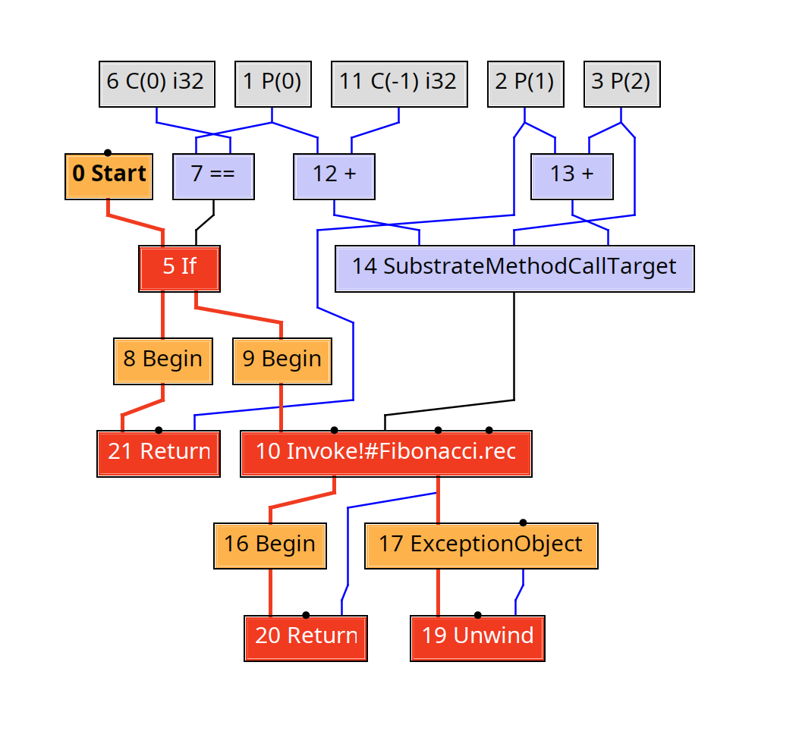
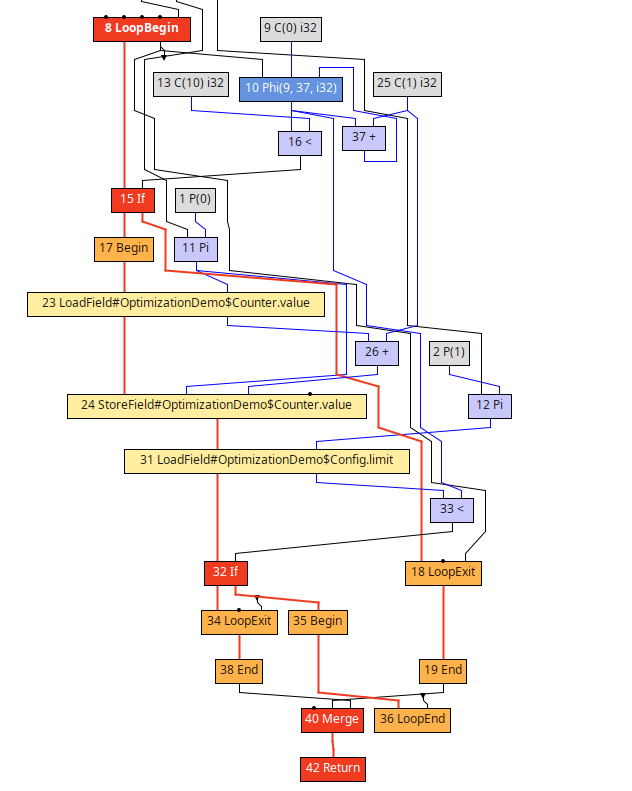

This document serves as a motivation and demonstration of use-cases of our work (as well as my personal notes).

## Graal IR Basics
Graal IR is a [sea-of-nodes](https://softlib.rice.edu/pub/CRPC-TRs/reports/CRPC-TR93366-S.pdf) (SoN) representation used by [GraalVM](https://www.graalvm.org/) compiler.
It contains a large amount of [nodes](https://github.com/oracle/graal/blob/master/compiler/src/jdk.graal.compiler/src/jdk/graal/compiler/graph/Node.java). Each node roughly corresponds to a high level instruction such as arithmetic, memory access, or a function call.
 
Nodes are roughly divided into two kinds:
 
- [Fixed](https://c9x.me/compile/bib/) nodes are pinned to a specific point in the control-flow order. They are connected to their neighbours via `successor` edges. `Invoke`, `If`, `Return`, and any node with side effects are typically fixed.
- [Floating](https://github.com/oracle/graal/blob/5d2611cedf4c733020519b2f8feeb18a66344a5a/compiler/src/jdk.graal.compiler/src/jdk/graal/compiler/nodes/calc/FloatingNode.java#L34) nodes are constrained only by their data dependencies (which are represented by `input` edges), not by any fixed position in control flow. 

The SoN representation was [introduced](https://www.researchgate.net/publication/2394127_Combining_Analyses_Combining_Optimizations) in order to battle the phase-ordering problem in optimizing compilers, e.g. how to order optimization passes.
Basically, the more nodes that can be classified as floating rather than fixed, the more freedom the scheduler and later optimization passes have in reorganizing the code, e.g. an `AddNode` with no side effects can float to whichever basic block is most profitable (such as being hoisted out of a loop). 
 
To demonstrate a simple Graal IR, suppose this Java program:
```java
public class Fibonacci {
    public static int rec(int n, int a, int b) {
        if (n == 0) {
            return a;
        }
 
        return rec(n - 1, b, a + b);
    }
 
    public static int fib(int n) {
        return rec(n, 0, 1);
    }
 
    public static void main(String[] args) {
        System.out.println(fib(5));
    }
}
```
 
The Graal IR of the `Fibonacci::rec` method is depicted below. The control edges are marked in red, whereas the data edges are marked in blue or black. There is a unique `Start` node, from which the control flows. The `Begin` node roughly corresponds to beginning of a basic block. One may find it strange that there are two control edges flowing from the `Invoke!#Fibonacci.rec` node,
this is because `Fibonacci.rec` is a recursive function, and Graal IR puts a stack-overflow check into the IR and creates two paths from this node one for normal return, and one for the exception path taken if a `StackOverflowError` is thrown, in which case the `Unwind` node is placed.
 

 
To quickly find more detailed examples of Graal IR. Take a look at [this](https://chrisseaton.com/truffleruby/basic-graal-graphs/) nice blog post.
 
# Case Study I - Memory Accessing Operations

Ok, now that we have introduced Graal IR, we can show a concrete limitation that we would like to mitigate, but for that we need to a little more theory behind how Graal IR models memory.

Graal tracks memory side effects using a concept called [LocationIdentity](https://github.com/oracle/graal/blob/5d2611cedf4c733020519b2f8feeb18a66344a5a/sdk/src/org.graalvm.word/src/org/graalvm/word/LocationIdentity.java#L55).
Every node that can write to memory implements either `SingleMemoryKill` (kills exactly one identity, exposed via `getKilledLocationIdentity()`) or `MultiMemoryKill` (kills several, via `getKilledLocationIdentities()`). Every node that reads from memory implements `MemoryAccess` and exposes the identity it depends on via `getLocationIdentity()`, plus a pointer to the last node that could have killed that identity via respective getter/setter.

`LocationIdentity` forms a small lattice:
- `LocationIdentity.any()` is the top element, which basically conflicts with everything.
- `NamedLocationIdentity` represents a named "family" of locations, e.g. all `int[]` elements, or a hand-picked identity for a class of internal VM fields.
- `FieldLocationIdentity` represents one identity per declared field, shared across all instances of that field (i.e. still not per-object, but already narrower than `any()`).

Ordering of two memory operations relative to eachother is decided purely by whether their
location identities overlap, but only for operations that are not already Fixed.
Two consecutive fixed nodes (e.g. two `Invoke`s) always keep their relative
position regardless of their location identities. 
The `LocationIdentity` overlap comes into play when assessing how to schedule floating memory access relative to fixed memory kill nodes around it. 
Two floating operations touching disjoint identities may be scheduled independently of each other and of
any intervening kill they don't overlap withtwo that might share an identity
must stay ordered relative to that kill.


```java
public static class Demo {
    class Counter { int value; }
    class Config { int limit; }

    static void bump(Counter counter) {
        counter.value++;
    }

    static void process(Counter counter, Config config, int n) {
        for (int i = 0; i < n; i++) {
            bump(counter);
            if (i > config.limit) {
                break;
            }
        }
    }

    public static void main(String[] args) {
        Config config = new Config();
        Counter counter = new Counter();
        config.limit = 10;
        process(counter, config, 10);
        System.out.println(counter.value);
    }
}

```
> Note to self: I originally had `counter.value += 1` instead of `bump(counter)`, which made Graal inline the `process` method entirely. With the `bump(counter)` version, there is an InvokeNode directly after building the Graal IR (`AnalysisStrengthenGraph` phase), but the `bump` method gets inlined, which leaves entirely the same Graal IR as before, but now the `process` method doesn't get inlined.

It is obvious that `bump(counter)`'s write and `config.limit`'s read are touching disjoint objects and therefore one we can easily conclude that it doesn't matter how these operations are ordered relative to each other in Graal IR, right. One might also conclude that `config.limit` never gets updated inside the loop and can be hoisted out of the loop completely. Right ? Well, let's take a look at the Graal IR of `process` method: 



I know that there is a lot happening in this picture, and it's not really clear what to focus on in this picture, however, we can see a loop starting at `8 LoopBegin` node. 
Then we can see linearly ordered memory operations with node ids `23, 24, 31`. This is strange because not only did Graal make the memory reads/writes fixed, but it also didn't hoist the read of config limit (Node 31) out of the loop.

TODO: this is kinda vague
Ok but why did this happen ? The thing is that the `bump(counter)` invoke messes up with the LocationIdentity - essentially it introduces a complete memory-barrier, and therefore both instructions are conservatively assumed to affect the same heap state, so Graal introduces a dependency between them. This is very costly, because inside the `process` method `config.limit` never changes across loop iterations, so the read is loop-invariant and should ideally be hoisted out of the loop. But because it's forced to depend on `bump`'s `any()` memory kill, it stays pinned inside the loop body. So clearly, the current mechanism how Invokes interfere with memory access nodes is a really big gap. I think that this gap is one of the things our research could try to mitigate.

## Intermezzo: How we might tackle this gap
What Graal does already support is promoting memory accesses from fixed to floating form.
This is the actual mechanism we would like to reuse/extend:

- **`FloatingAccessNode`** is the floating counterpart of a fixed memory access. A fixed access such as `ReadNode` exposes `canFloat()`, and when it can, `asFloatingNode()` converts it into the equivalent floating node.
- **`FloatingReadPhase`** is the compiler phase that performs this conversion. It essientially walks the fixed nodes, and for every `FloatableAccessNode` that can float, looks up the current last known kill of its location identity in a per-location map.
- **`SchedulePhase`** is the phase that assigns floating nodes to basic blocks once they are floating. It computes is the earliest/latest legal basic block for each floating node  based on data dependencies and, on the latest side, on which blocks are known to kill the node's `LocationIdentity`. A block containing an invoke that kills `any()` blocks every floating access from being scheduled past it, regardless of what that access actually touches.

So we want to narrow the `LocationIdentity` that `InvokeNode`s report, not change their fixed/floating status. `InvokeNode` already has a constructor overload accepting an explicit `LocationIdentity` instead of defaulting to `any()`. If a call's kill identity is narrowed based on points-to information (e.g. tagged with a `Counter`-heap token instead of `any()`), then:

- `FloatingReadClosure.processAccess`/`processCheckpoint` will only invalidate the map entry for that specific identity, instead of clearing the whole map — `config.limit`'s entry survives across the `bump(counter)` call.
- `SchedulePhase`'s kill-set computation no longer treats every block containing `bump` as killing everything, so the read of `config.limit` becomes a legal candidate to float, hoist out of the loop, and get scheduled once instead of every iteration.

No changes to `FloatingReadPhase` or `SchedulePhase` themselves are required — both already consume `LocationIdentity` at the right granularity. The only missing piece is a source of narrower identities for ordinary method calls, which is what the points-to-informed heap-partition analysis in this project aims to provide.

**The SSU angle:** the project's proposal is to break this monolithic memory dependency into fine-grained, partitioned linear tokens (e.g. a `Counter`-heap token and a separate `Config`-heap token). Disjoint heap regions then get independent data-flow paths, and the false dependency between `bump`'s write and `config.limit`'s read disappears — unblocking the hoist. The same mechanism addresses three related problems at once:

- **Breaking the monolithic memory graph.** A single write currently invalidates memory state globally for the local optimizer, because Graal can't cheaply tell whether a read and a write touch different heap regions without deep, expensive alias analysis across the whole graph. Partitioned tokens make disjointness explicit and free.

- **Reducing reliance on aggressive inlining.** Industrial compilers lean on inlining small functions (getters/setters) specifically to extend the reach of local optimizations — at the cost of code bloat, worse instruction-cache behaviour, and AOT compile-time overhead. Lightweight interprocedural summaries (input/output side-effect tokens on the function prototype) let Graal optimize a call site without inlining the callee body.
- **Unlocking LICM/CSE/DCE that are currently blocked.** Rigid control and memory-ordering edges between operations prevent loop-invariant reads from floating and prevent pure/repeated calls from being deduplicated or removed. Replacing those rigid edges with flexible data-dependency chains lets Graal's existing scheduler reorder and hoist freely.

## Case Study II: Dead Store Elimination
```java
static void unrelatedWork(Logger logger) { logger.count++; }

static void resetCounter(Counter counter, Logger logger) {
    counter.value = 1;
    unrelatedWork(logger);
    counter.value = 2;
}
```
