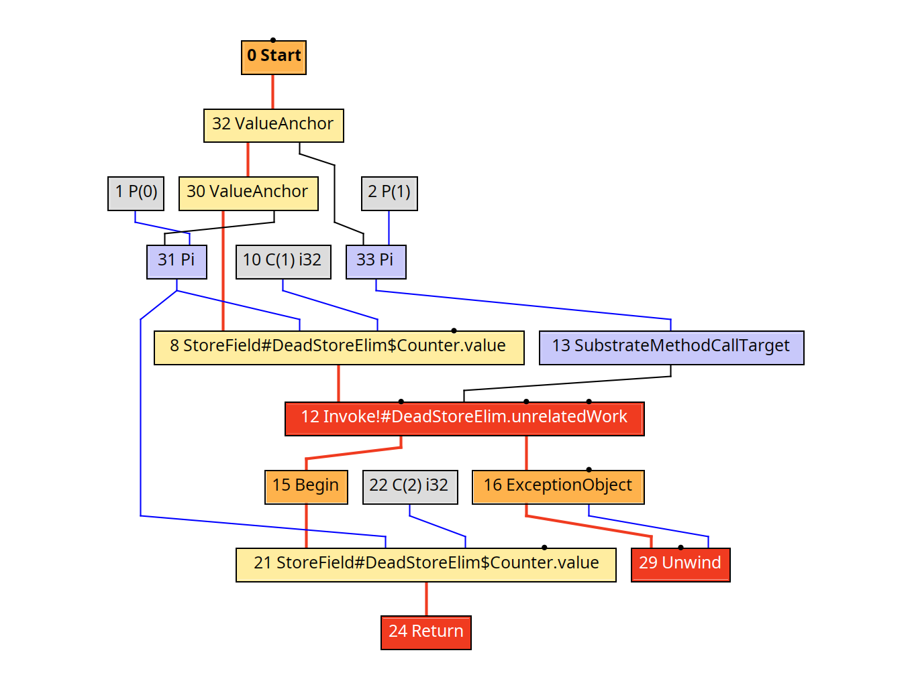
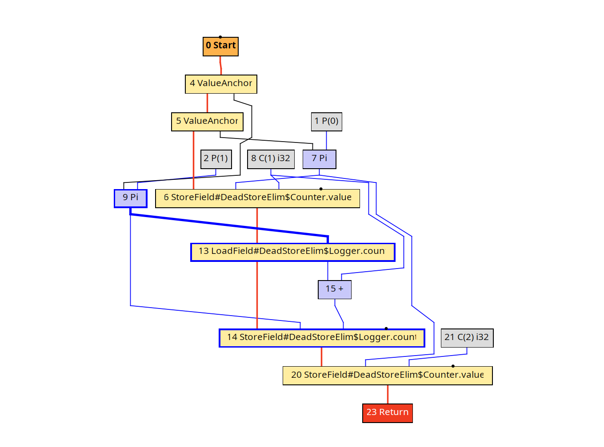

# Motivation
Whole-program sound interprocedural abstract interpretation is really hard to implement efficiently and correctly.
This is due to the sheer scope it has to overcome, while dealing with all the related hard parts, 
which means handling context sensitivity, functions summaries, recursion and etc. 


We want to sidestep this difficulty rather than solve it.
Instead of computing a new abstract interpretation of the program ourselves, we rely on points-to information that Native Image's own analysis already computes,
and treat it as a given input rather than something we need to derive.

Essentially, our goal is to make side-effects explicit in the program
representation so that analyses and optimizations can reason about
them as ordinary data dependencies. The rest of this document is concerned with providing use cases and outlining the 
core techniques/ideas of this proposal 

# Core Idea

The central idea is to represent side effects using explicit values. A conventional function can be viewed as:
`f : arguments → result`
A function with an explicit state/effect token can instead be viewed as:
`f : state × arguments → result × state`

The state token represents some portion of the program state that the function
may observe or modify. For example, for I/O:
```
io_read  : world × fd → value × world
io_write : world × fd × value → world
```

The important property is that the state is represented as a value.
The sequence 
```
w1 ← io_write(w0, fd, 3)
w2 ← io_write(w1, fd, 4)
``` 
contains an explicit data dependency ```w0 → io_write → w1 → io_write → w2```.
The ordering of the two operations is therefore represented by data flow.
The same idea can be applied to heap effects. Instead of one global `heap`, we could have multiple independent effect tokens:
```
counter_heap
logger_heap
config_heap
```

A function modifying only `Counter` state would consume and produce the
`counter_heap` token, while a function modifying only `Logger` state would
consume and produce `logger_heap`.

Operations on the two regions would then have no data dependency between
their effect tokens and wouldn't need to be ordered just because
both operations access memory.

# Graal IR Basics
The concrete experimental setting for this work is the Sea-of-Nodes (SoN)
representation generated by GraalVM from Java programs.

Graal IR is a [sea-of-nodes](https://softlib.rice.edu/pub/CRPC-TRs/reports/CRPC-TR93366-S.pdf) (SoN) representation used by [GraalVM](https://www.graalvm.org/) compiler.
Each [node](https://github.com/oracle/graal/blob/master/compiler/src/jdk.graal.compiler/src/jdk/graal/compiler/graph/Node.java) in Graal IR roughly corresponds to a high-level instruction such as addition, memory access, or a function call.
 
Nodes are roughly divided into two kinds:
 
- [Fixed](https://github.com/oracle/graal/blob/master/compiler/src/jdk.graal.compiler/src/jdk/graal/compiler/nodes/FixedNode.java) nodes are pinned to a specific point in the control-flow order. They are connected to their neighbours via `successor` edges. `Invoke`, `If`, `Return`, and any node with side effects are typically fixed.
- [Floating](https://github.com/oracle/graal/blob/5d2611cedf4c733020519b2f8feeb18a66344a5a/compiler/src/jdk.graal.compiler/src/jdk/graal/compiler/nodes/calc/FloatingNode.java#L34) nodes are constrained only by their data dependencies, which are represented by `input` edges. 

The SoN representation was [introduced](https://www.researchgate.net/publication/2394127_Combining_Analyses_Combining_Optimizations) in order to deal with the phase-ordering problem in optimizing compilers.
Essentially, the main idea is, the more nodes that can be classified as floating rather than fixed, the more freedom optimization passes have in reorganizing the code, e.g. an `AddNode` with no side effects can float to whichever basic block is most profitable (such as being hoisted out of a loop). 
 
To demonstrate a simple Graal IR, suppose this Java program:
```jsx
public class Fibonacci {
    public static int rec(int n, int a, int b) {
        if (n == 0) {
            return a;
        }
 
        return rec(n - 1, b, a + b);
    }
 
    public static int fib(int n) {
        return rec(n, 0, 1);
    }
 
    public static void main(String[] args) {
        System.out.println(fib(5));
    }
}
```
 
The Graal IR of the `Fibonacci::rec` method is depicted below. The control edges are marked in red, whereas the data edges are marked in blue or black. There is a unique `Start` node, from which the control flows. The `Begin` node roughly corresponds to beginning of a basic block. One may find it strange that there are two control edges flowing from the `Invoke!#Fibonacci.rec` node.
This is because `Fibonacci.rec` is a recursive function, and Graal IR puts a stack-overflow check into the IR and creates two paths from this node one for normal return, and one for the exception path taken if a `StackOverflowError` is thrown, in which case the `Unwind` node is placed.
 

 
To quickly find more detailed examples of Graal IR. I recommend looking at [this](https://chrisseaton.com/truffleruby/basic-graal-graphs/) nice blog post.
 
# The Problem: Conservative Side Effects
The problem we want to investigate is that calls are often treated as having
much broader memory effects than they actually have.

Suppose:

```jsx
class Counter {
    int value;
}

class Config {
    int limit;
}

static void bump(Counter counter) {
    counter.value++;
}

static void process(Counter counter, Config config, int n) {
    for (int i = 0; i < n; i++) {
        bump(counter);

        if (i > config.limit) {
            break;
        }
    }
}
```

The write performed by `bump(counter)` and the read of `config.limit` are
conceptually independent because `bump` modifies `Counter`, while the loop reads `Config`.
Ideally, the compiler should therefore be able to reason that these two memory accesses are independent.
This would mean the read of `config.limit` should be a candidate for loop-invariant
code motion. However, this is not necessarily what happens in the current Graal memory
representation, and we will explain why.

# Graal Memory Model

Graal tracks memory side effects using a concept called [LocationIdentity](https://github.com/oracle/graal/blob/5d2611cedf4c733020519b2f8feeb18a66344a5a/sdk/src/org.graalvm.word/src/org/graalvm/word/LocationIdentity.java#L55).
Every node that can write to memory implements either `SingleMemoryKill` (kills exactly one identity) or `MultiMemoryKill`. Every node that reads from memory implements `MemoryAccess` and exposes the identity it depends on via `getLocationIdentity()`, and a pointer to the last node that could have killed that identity via respective getter/setter.

`LocationIdentity` forms a small lattice:
- `LocationIdentity.any()` is the top element, which basically conflicts with everything.
- `NamedLocationIdentity` represents a named "family" of locations, e.g. all `int[]` elements, or a hand-picked identity for a class of internal VM fields.
- `FieldLocationIdentity` represents one identity per declared field, shared across all instances of that field (i.e. still not per-object, but already narrower than `any()`).

Ordering of two memory operations relative to each other is decided purely by whether their
location identities overlap, but only for operations that are not already Fixed.
For floating operations, memory dependencies are affected by whether their
location identities overlap.
Two floating operations touching disjoint identities can potentially be
scheduled independently.
Fixed operations remain ordered by control flow regardless of whether their
location identities overlap.

# Case Study I - Loop-Invariant Memory Access 
Consider:
```jsx
public static class Demo {
    class Counter { int value; }
    class Config { int limit; }

    static void bump(Counter counter) {
        counter.value++;
    }

    static void process(Counter counter, Config config, int n) {
        for (int i = 0; i < n; i++) {
            bump(counter);
            if (i > config.limit) {
                break;
            }
        }
    }

    public static void main(String[] args) {
        Config config = new Config();
        Counter counter = new Counter();
        config.limit = 10;
        process(counter, config, 10);
        System.out.println(counter.value);
    }
}
```

It should be easy to deduce that the read of `config.limit` is loop invariant: nothing in the loop modifies
`config.limit`. We would therefore like to hoist it out of the loop. When we look at the Graal IR, however, the memory operations become linearly
ordered. We can see a loop starting at `8 LoopBegin` node, and we also see that the memory operations with node IDs `23`,
`24`, and `31` remain ordered, and the read of `config.limit` is not hoisted.


Ok but why did this happen ? The call to `bump(counter)` introduces a conservative memory effect. When an
`InvokeNode` is represented as killing `LocationIdentity.any()`, the compiler
has to assume that the invocation could have modified essentially any memory
location. Consequently, the read of `config.limit` is treated as potentially dependent
on `bump(counter)` even though the two operations access independent objects.

## Existing Graal API: Floating Memory accesses 
What Graal does already support is promoting memory accesses from fixed to floating form.
This is the actual mechanism we would like to reuse/extend:

- **`FloatingAccessNode`** is the floating counterpart of a fixed memory access. A fixed access such as `ReadNode` exposes `canFloat()`, and when it can, `asFloatingNode()` converts it into the equivalent floating node.
- **`FloatingReadPhase`** is the compiler phase that performs this conversion. It essentially walks the fixed nodes, and for every `FloatableAccessNode` that can float, looks up the current last known kill of its location identity in a per-location map.
- **`SchedulePhase`** is the phase that assigns floating nodes to basic blocks once they are floating. It computes is the earliest/latest legal basic block for each floating node based on data dependencies.

Basically, we want to narrow the `LocationIdentity` that `InvokeNode`s report.
The good news is that `InvokeNode` already has a constructor overload accepting an explicit `LocationIdentity` instead of defaulting to `any()`. 
If a call's kill identity is narrowed based on points-to information (e.g. tagged with a `Counter`-heap token instead of `any()`), then:

- `FloatingReadClosure.processAccess`/`processCheckpoint` will only invalidate the map entry for that specific identity, instead of clearing the whole map which would mean `config.limit`'s entry survives across the `bump(counter)` call.
SchedulePhase's memory-dependency computation can potentially become more precise because a block containing bump would no longer be considered to kill every memory location

## Case Study II: Dead Store Elimination
The concepts in this case study will be very similar to what we have already seen, however now we want to remove nodes entirely instead of doing code motion.
Suppose:

```jsx
static void unrelatedWork(Logger logger) { logger.count++; }

static void resetCounter(Counter counter, Logger logger) {
    counter.value = 1;
    unrelatedWork(logger);
    counter.value = 2;
}
```

The first write to `counter.value` is dead: it is unconditionally overwritten by the second write, and nothing observable can read `counter.value` in between, since `unrelatedWork` only ever touches `logger`.
An ideal compiler should emit only the second WriteNode(counter.value, 2) and drop the first.
Let's look at the Graal IR at `afterAnalysisStrengthenGraphs` phase:

We can see that the invoke of `unrelatedWork` gets inserted in Graal IR, and as one can suspect, we run into the identical problem as in Case Study I: `Invoke!#unrelatedWork` defaults to LocationIdentity.any(), so it invalidates every entry in that per-location map, not just Logger's. 
The elimination passes have no way to know `unrelatedWork` couldn't have read or written `counter.value`, so they must conservatively treat the call as a potential read of the first store's value and a potential kill of the same identity. Either way, the redundant store to counter.value = 1 survives to codegen.
And even after inlining, the memory accesses are fixed. 


So the problem is not necessarily that the optimizer lacks a DSE algorithm, but it
is that the representation does not expose enough information about which
memory the call can affect.

# Generalization: Side-Effect Analysis
Now, we can formulate our motivation from the beginning more clearly.
From the two presented uses cases, we can see a more general problem.

Consider:
```text
operation A
    │
    ▼
call f()
    │
    ▼
operation B
```

If `f` may access all memory, the compiler conservatively has to preserve
dependencies between `A`, `f`, and `B`. If we know that:
```text
A → partition P1
f → partition P2
B → partition P1
```

then `f` does not need to interfere with the dependency between `A` and `B`
on `P1`. The problem therefore becomes:

> How can we obtain and represent a precise-ish description of the
> memory effects of a function?

Essentially, this is the problem we are trying to solve.

# Implementation / Details
Now we are really getting into unknown territory. I am currently not even close (honestly, not even far) from having the concrete implementation details figured out,
however, that doesn't mean we can't provide a general outline we ought to follow.

Essentially the result of this work should be a tool that performs a conversion from SoN to SSU and then back to SoN.
Since the core transformation of IR happens outside of Graal we need to export Graal IR points-to information and process this information in our tool.
So basically the entire process can be described as:

- Export Graal IR points-to info
- Parse the Export
- SSU Conversion 
- profit
- SSU to SoN Conversion

The following text is concerned with various implementation details that we encounter throughout our work.

# Heap Modelling
We want to divide the heap into non-overlapping abstract regions. Each region will recieve its own effect token.
How exactly to model heap remains a question. 
We could potentially pull out one of these classics:
* allocation sites;
* abstract objects;
* fields;
* object + field pairs;
* types;
* maximal alias sets;
* combinations of the above.

For example, if:

```text
p → { A, B }
q → { B }
r → { C }
```

then `p` and `q` may access overlapping state because they may both refer to
`B` and `r` cannot alias either of them. One possible partitioning is therefore:

```text
P1 = { A, B }
P2 = { C }
```

The main requirement is soundness
> Two operations must only be considered independent when the abstraction
> guarantees that they cannot affect the same concrete state.

However, the initial implementation should favor a simple and clearly sound
abstraction over maximum precision.

# Points-to Analysis
Graal points-to analysis should in theory provide the information needed to construct these partitions.

Since we want to implement our tool outside of Native Image, we shall export points-to information to some abstract format which will contain the information needed for our analysis.
At minimum, we will probably need:

* allocation sites;
* object types;
* points-to sets for reference-valued values;
* parameter → points-to relationships;
* return-value → points-to relationships;
* field/type information;
* field accesses;

The exported information should allow the prototype to answer four questions:
1. What abstract objects can this reference point to?
2. Which heap locations can this operation access?
3. Which heap locations can this method access?
4. Which locations may alias each other?


# Questions

1. Is `LocationIdentity` the right abstraction to use for representing
points-to-derived heap partitions?

2. Would assigning a more precise `LocationIdentity` to `InvokeNode`s be
sufficient to allow existing memory optimizations, such as
`FloatingReadPhase` and scheduling, to exploit the additional information?

3. Are there important interactions with `MemoryKill`, `MemoryAccess`,
`FloatingReadPhase`, or `SchedulePhase` that this approach is currently
overlooking?

4. Does Native Image's points-to analysis expose enough information to
construct sound heap partitions outside of Native Image?

5. Is there already existing Graal infrastructure for representing or
querying the memory effects of an `InvokeNode` that we should build upon
rather than exporting our own representation?

6. Are there cases where replacing `LocationIdentity.any()` with a
points-to-derived identity would be unsound or insufficient?

7. More generally, does this seem like a reasonable direction for reducing
unnecessary memory dependencies in Graal?
